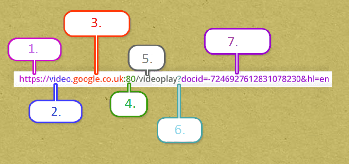

# EXAM: Java Spring

## Getting Started

- Fork this repository under your own account
- Clone the forked repository to your computer
- Please commit frequently, but push only ONCE at the end of the exam
- Go through the whole description before starting it

## What can I use?

- You can use any resource online, but please work individually
- Instead of copy-pasting your answers and solutions, write them in your own words
- **Don't push your work to GitHub until your mentor announces that the time is up**

# Tasks

## Setup a new project

- Create a new Spring Boot project inside your cloned repository
- Setup .gitignore file to exclude the IDE's generated files
  - the src directory should be committed (containing all java and resource files)
  - the gradle related files should be committed
  - the resource folder should be committed
  - the gitignore should be committed
- Create a package called com.greenfox.exam.spring and work under that

## Green Fox Quiz API

### Description

Your task is to create a RESTful quiz application with full of greenfox questions hence giving the possibility to make it reachable and reuseable by any other services.

### Get 5 random questions

- Create a `GET /questions` endpoint
- Get 5 random questions in JSON object from an SQL database that you create
- the JSON object should be:

```json
{
  "id": 1,
  "questions":[
    {"id": 1, "question": "What is the color code of Green Fox?"},
    {"id": 2, "question": "When was Green Fox founded?(yyyy.mm.)"},
    ...
   ]
}
```

- Below you can find some more question and answer example, please add them all to the database, to one table:
    - When did your course start? (yyyy.mm.dd)(2017.03.13)
    - What type of dog Barbi has? (Whippet)
    - What is HerrNorbert's favourite color? (Green)
    - How many classes are learning at Green Fox Academy at this moment? (4)
    - How many mentors does the Green Fox have? (16)
    - What was the name of the first Green Fox Class? (Velox)
    - How many likes do we have on facebook? (~3300)
    - What is Tojas's horoscope? (Libra)
- Feel free to add some new, if you have the time

### Give the answer
- Create a `POST /answers` endpoint
- Post the answers to the 5 random questions
- Make sure that the user answers to exactly that 5 questions
- This endpoint should receive the following input

```json
{
  "id": 1,
  "answers":[
  {"id": 1, "answer": "#3CB879"},
  {"id": 2, "answer": "2015.09."},
  ...
    ]
 }
  ```

- Regarding the response, continue reading

### Response of POST endpoint
- In the case that all of the given answers are **CORRECT** you should get a list of projects in this endpoint
- In case some of the answers are **not** correct you should get back an empty list
- The list of projects will be the highly awaited titles of the actual projects you will work on in the project phase :)
- The response format should be the following:
```json
{
  "projectList":[
    {"id":1,"nameOfProject":"Porject 1"},
    {"id":2,"nameOfProject":"Project 2"},
     ...
   ]
}
```
- You should send an HTTP request to this endpoint "https://springexamserver.herokuapp.com/projects/className" and make it as the response of the POST endpoint
- Instead of `"className"` goes the name of your class

### Endpoint TESTing
- Create 2 endpoint tests

## Question time!

### In what cases would you choose to use an abstract class over an interface?

Please define it with your own words. We are expecting at least 3 distinct ideas that you write here:


### Analyzing URL
Please name the parts of the URL below.
[](assets/URLanalysis.png?raw=true)

1:  
2:  
3:  
4:  
5:  
6:  
7:  
